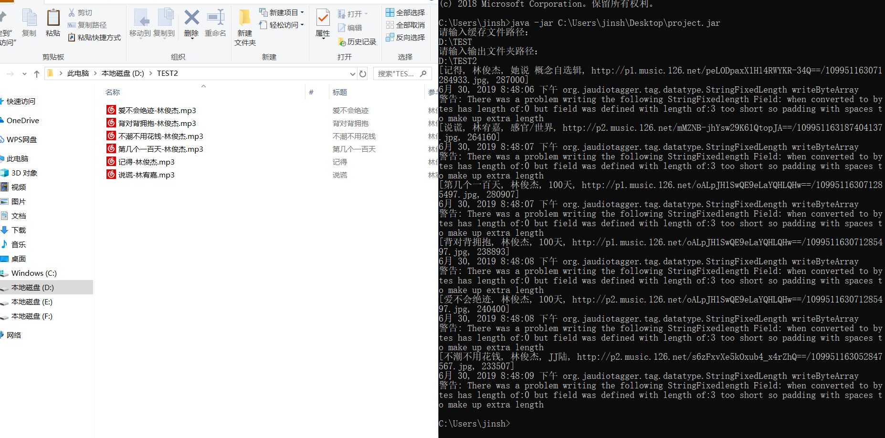

# Cracker

# 项目介绍
* 解决网易云音乐只能试听缓存不能下载的问题
* 将缓存的音乐解码并写入歌曲名等信息
* 仅供个人学习研究，不得侵犯版权

# 运行环境
- **JAVA8及以上**

# 使用

```
git clone https://github.com/KingSF5/Cloudmusic.git
java main
```

# 贡献

*SCUjava一班九小组*

## 运行截图


